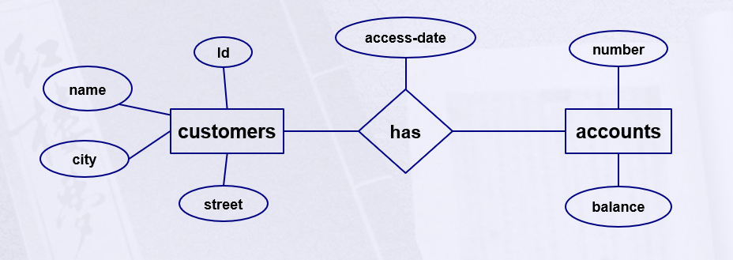
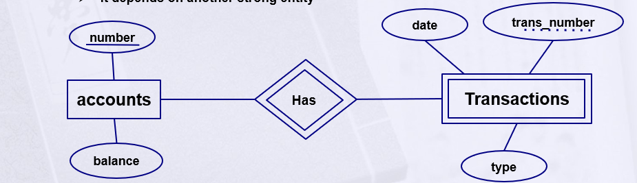
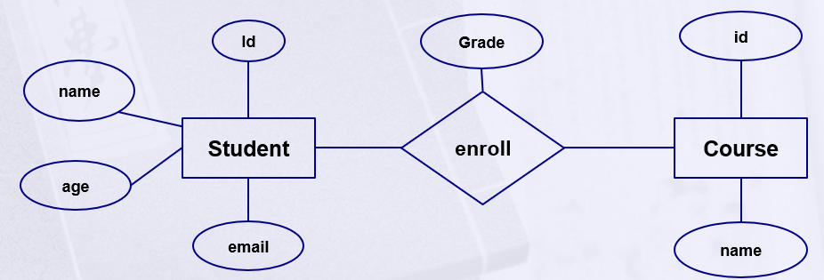

# Database

## File-Based System
- Cons:
  - Duplication of data.
  - No data sharing.
  - Search (linear, sequential).
  - No constraints (no conditions).
  - No standardization.
  - Program data dependence.
  - No security (admin, user access).
  - Backup (manual copy).
  - No relationships.

## Database Advantages
- Standardization:
  - Better data accessibility.
- Sharing data:
  - The ability to share the same data resource with multiple applications or users.
- Enforcing integrity constraints:
- Restricting unauthorized access.
- Providing backup and recovery:
  - Disaster recovery is easier.
- Minimal data redundancy:
  - Leads to increased data integrity/consistency.
- Program data independence.

## Database Disadvantages
- It needs expertise to use.
- DBMS itself is expensive.
- The DBMS may be incompatible with any other available DBMS.

## Database Life Cycle
1. Analysis → System Analyst:
   - Requirement document.
2. Database Design → Database Designer:
   - Entity Relationship Diagram (ERD).
3. Database Mapping → Database Designer:
   - Database schema.
4. Database Implementation → Database Developer:
   - Using DBMS (SQL) to create the database.
5. Application → Application Programmer:
   - Web - Desktop - Mobile.
6. Client → End User:
   - Use database indirectly through the application.

## Database Users
- Database Administrator (DBA).
- System Analysts.
- Database Designer.
- Database Developer.
- Application Programmers.
- BI & Big Data Specialist (Data Scientist).
- End Users.

## Entity Relationship Diagram Concepts

### Basic Constructs of the ER model
1. Entities:
   - person, place, object, event, concept (often corresponds to a real time object that is distinguishable from any other object).
   - Represented in **rectangles**.
2. Attribute:
   - property or characteristic of any entity type (often corresponds to a field in a table).
   - Represented in **ellipses**.
3. Relationships:
   - link between entities (corresponds to primary key-foreign key equivalencies in related tables).
   - Represented in **diamonds**.
   - May have attributes.
- Example:
   

### Strong Entity vs. Weak Entity
- Strong entity:
  - An entity set that has a primary key.
  - It doesn't depend on any other entity.
- Weak entity:
  - Doesn't have any primary key because it doesn't have sufficient attributes to form a primary key, but it has a **partial** key.
  - It depends on another strong entity.
  - Represented by double rectangles.
- Example:
   

### Type of Attributes
1. Simple Attribute.
    - The default one.
    
2. Composite Attribute.
   - An attribute that consists of multiple attributes.
   
3. Multi-valued Attribute.
   - An attribute that may have multi value.
   
4. Derived Attribute. 
   - An attribute that depends on another.
   - They don't exist physically in the database.
   
5. Complex Attribute.
   - Multi-valued + composite.
   

### Relationships
- A relationship is an association among several entities.
- A relationship may also have attributes.
- Ex:
  - Consider the entity sets (student and course) and the relationship set enroll,
    We could associate the attribute **Grade** with that relationship to specify the grade of student in course.
  
- Relationship has three properties:
  1. Degree of relationship.
     - Degree: number of entity types that participate in a relationship.
     - Three cases:
       - Unary (Recursive): 
         - between two instances of one entity type.
         
       - Binary: 
         - between the instances of two entity types.
         
       - Ternary: 
         - among the instances of three entity types.
         
  2. Cardinality constraint.
     - How many instances of one entity will or must be connected to a single instance from the other entities:
       - One-One Relationship.
         
       - One-Many Relationship.
         
       - Many-Many Relationship.
         
  3. Participation constraint.
     - An employee MUST work for a department:
       - An employee entity can exist only if it participates in a WORKS_FOR relationship instance.
       - So, this participation is **TOTAL** (mandatory).
     - Only some employees manage departments:
       - The participation is **PARTIAL** (optional).
     - Ex:
       - An employee may have a car.
       - A car must be assigned to a particular employee.
       

### Keys
1. Candidate Key.
   - A set of attributes that can uniquely identify a record in a table. 
   - Multiple candidate keys may exist, but only one is chosen as the primary key. 
   - Example: In a Students table, both StudentID and Email could be candidate keys if both are unique. 
   - Purpose: Provides options for selecting a primary key.
2. Primary Key.
   - A unique identifier for each record in a table. 
   - Must be unique and cannot be null. 
   - Only one primary key per table (can be a single column or a combination of columns, known as a composite key). 
   - Example: A StudentID column in a Students table. 
   - Purpose: Ensures each record is uniquely identifiable and prevents duplicate entries.
3. Foreign Key.
   - A field (or set of fields) in one table that matches the primary key or a unique key in another table. 
   - Establishes a relationship between two tables. 
   - It Can be null (depending on the relationship) and may allow duplicates. 
   - Example: A DepartmentID in an Employees table that references the DepartmentID primary key in a Departments table. 
   - Purpose: Enforce referential integrity, ensuring valid relationships between tables.
4. Composite Key (Compound key).
   - A primary key made up of two or more columns to ensure uniqueness. 
   - Used when a single column isn’t sufficient to uniquely identify records. 
   - Example: In an OrderDetails table, a combination of OrderID and ProductID might form the composite key. 
   - Purpose: Uniquely identifies records in tables with complex relationships.
5. Partial Key. 
   - Attributes that uniquely identify records in a weak entity but only within the scope of a strong entity’s primary key.
   - Used in weak entities that depend on a strong entity for identification.
   - Example: In an OrderItem table (weak entity), ItemNumber is a partial key, unique only within an OrderID (from the strong entity Order).
   - Purpose: Forms part of the weak entity’s primary key when combined with the strong entity’s primary key.
6. Alternate Key. 
   - A candidate key that is not selected as the primary key. 
   - Example: If StudentID is the primary key, an Email (if unique) could be an alternate key. 
   - Purpose: Provides alternative ways to uniquely identify records.
7. Super Key.
   - A set of one or more columns that can uniquely identify a record. 
   - Includes any combination of attributes that ensures uniqueness (e.g., a primary key or candidate key is a minimal super key). 
   - Example: In a Students table, {StudentID, Name, Email} could be a super key, but only StudentID might be needed as the primary key. 
   - Purpose: A theoretical concept used to derive candidate and primary keys.

## Case Study
- Problem:
  [Company Requirements](data/Company%20Requirements.docx)
- Solution:
  
